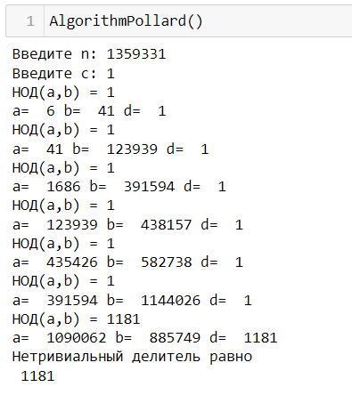
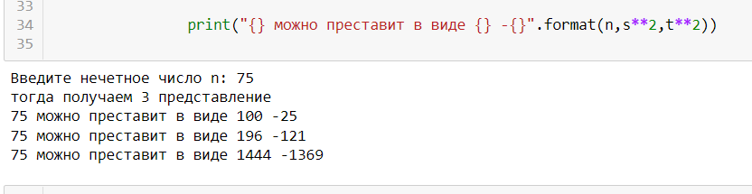

## РОССИЙСКИЙ УНИВЕРСИТЕТ ДРУЖБЫ НАРОДОВ

### Факультет физико-математических и естественных наук

### Кафедра прикладной информатики и теории вероятностей

#### Презентация ПО

#### ЛАБОРАТОРНОЙ РАБОТЕ №6

***дисциплина: Математические основы защиты информации и информационной безопасности***

Студент: Хиссен Али Уэддей\
Группа: НПМмд-02-20\
Ст. билет № 1032209306

## Цель работы

Изучиe алгоритм разложение чисел на множители..

# Теоретические часть

### Алгоритм, реализующий р-метод Полларда.

Вход. Число n, начальное значение с, функция f,	обладающая сжимающими свойствами.
Выход. Нетривиальный делитель числа n.

1. 	Положить a←с, b ← С.
2. Вычислить a ←f(а)(mod n), b ← f(b) (mod n)
3.	Найти d ← Н0Д(a — b, n).
4.	Если 1 < d < n, то положить р ← d и результат: р. При d = n 	результат: <<Делитель не найден >>; при d =1 вернуться на шаг 2.

Например : найти р-методом Полларда нетривиальный делитель числа n=1359331.	Положим	с = 1 и	f(x) = x^2^ +  5 (mod n).	

## Метод кеадратов. (Теорема Ферма  о разложении) 
Для любого положительного нечетного числа n существует взаимно однозначное соответствие между множеством делителей числа n, не меньших, чем $\sqrt{n}$ , и множеством пар {s,t} таких неотрицательных целых чисел, что п = s^2^ - t^2^.
Например . У числа 15 два делителя, не меньших, чем  $\sqrt{15}$ , — это числа 5 и 15.
Тогда получаем два представления:
1. 15 = pq =3.5, откуда s = 4, откуда t= 1 и 15 = 4^2^ — 1^2^;
2. 15 = pq = 1.15, откуда s =8, откуда t = 7 и 15 = 8^2^ — 7^2^ .

# програмная часть 

## Альгоритм, реализующий р-метод Полларда  ##

**результата вызова функцию, реализующая р-метод Полларда**

**Тогда пр n =1359331, его нетривиальный детитель равно 1181**

## Альгоритм, реализующий метод Квадратов  ##

резултат работы метода 

**вывод** Мы изучали алгоритм для разложния чисел на множители..

